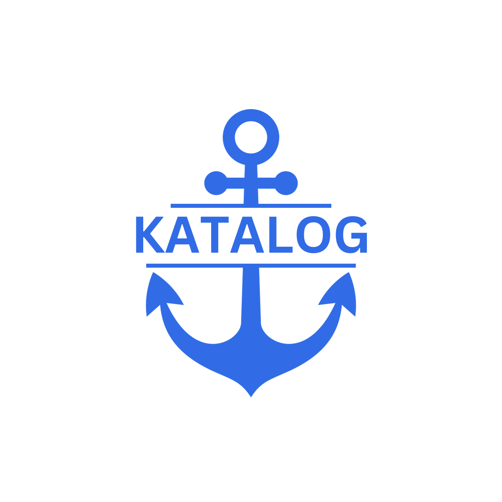

<div align="center">
  
</div>

## Sections

- [About](#about)
- [Installing Fluentd](#installing-fluentd)
- [Utilizing KataLog](#utilizing-katalog)
- [Demo](#demo)
- [License](#license)
- [Contribute](#contribute)
- [Authors](#authors)

## About:

KataLog is a log visualization tool that makes reading Kubernetes logs that are collected by Fluentd much simpler.  At this time, KataLog receives Fluentd logs via HTTP; however, work is being done to allow for a user to store Fluentd logs locally and send them to KataLog’s database via a backend service.

KataLog’s frontend is a UI that provides insights into Kubernetes logs collected via Fluentd.  Upon visiting the Dashboard, KataLog will display high-level insights into your Kubernetes cluster.  The components rendered on the dashboard can be interacted with to display logs associated with these specific areas of your cluster.  The Logs page will display all logs collected via Fluentd in an easy-to-digest way.  The Logs page allows a user to filter and search through their collected logs.

In short, Katalog’s dashboard will display high-level cluster information, while the Logs page will display granular details about the collected logs.  To utilize KataLog, start by installing Fluentd.  Afterwards, visit KataLog’s UI to view your collected logs.

## Installing Fluentd:

Click on the link below that corresponds to your use case:

<a href="https://docs.fluentd.org/installation/install-by-rpm">Install Fluentd by RPM package (Redhat Linux)</a> 

<a href="https://docs.fluentd.org/installation/install-by-deb">Install Fluentd by Deb package (Ubuntu/Debian Linux)</a> 

<a href="https://docs.fluentd.org/installation/install-by-msi">Install Fluentd by DMG package (Mac OS X)</a> 

<a href="https://docs.fluentd.org/installation/install-by-gem">Install Fluentd by Ruby Gem</a> 

<a href="https://docs.fluentd.org/installation/install-from-source">Install Fluentd from source</a> 

Don’t worry about configuring your Fluentd files for now–we’ll handle this in the next step.

## Fluentd Configuration Files:

Head to KataLog and create an account.  After being redirected to the Dashboard, click on the Fluentd Configuration page.  On this screen, you’ll be prompted to input your username, the project’s name for which you wish to centralize and visualize your logs for, and your machine’s architecture.  (Not sure about your machine’s architecture? Just follow the steps at the end of this section of the Readme).

After inputting your information, you’ll be given three separate files: `default.conf`, `fluentd-configmap.yaml`, and `fluentd-daemonset.yaml`.  Your job now is to create these respective files in your project’s workspace–all you need to do is copy and paste the generated text into each respective file.  We recommend creating a `monitoring/` directory at the top level of your project to store all three files within.

Once you’ve generated the text configurations and copied them into the files you’ve created, navigate to the directory in which they live via the Terminal/Command Line.  You will then need to apply the `.yaml` files using the following commands:

```sh
kubectl apply -f fluentd-configmap.yaml
```

```sh
kubectl apply -f fluentd-daemonset.yaml
```

To confirm that you have properly integrated Fluentd, run this command in your Terminal/Command Line:

```sh
kubectl get pods
```

Note your Fluentd container name.  Once you have it, run this command in your Terminal/Command Line:

```sh
kubectl logs FLUENTD_CONTAINER_NAME
```

Fluentd will print you its own logs generated so far as well as the current `configmap.yaml` that you have applied.

To find your machine’s architecture, run the following command in your Terminal or Command Line:

Linux/Mac OS:

```sh
arch
```

Windows:

```sh
wmic os get osarchitecture
```


## Utilizing KataLog

Once you have Fluentd integrated into your project, return to KataLog’s UI and select your project from the dropdown menu in the top right corner of the header.  If you are on the Dashboard, you’ll be presented with a visual representation of your cluster.  Each hexagon that renders corresponds to a component of your cluster.  You can click on a respective hexagon to view the logs collected for each of these components.  Note the high-level statistics regarding your cluster, such as logs collected and nodes running.

After you’ve viewed your cluster’s Dashboard, visit the Logs page to view all logs that Fluentd has collected so far.  You will need to select your project from the same header dropdown on the Logs page.  Once selected, you can use the Filter or Search functions on this page, and can clear the Filters by clicking the icon.

## Demo
If you do not already have a microservice application with which to test KataLog but would like to, we encourage you to try it with the OpenTelemetry Demo application. Instructions for setup can be found <a href="https://opentelemetry.io/docs/demo/kubernetes-deployment/">here</a>.

## License
Distributed under the MIT License. See [`LICENSE.txt`](./LICENSE.txt) for more information.

## Contribute
We welcome contributions to KataLog from the open source community. Feel free to open an issue or submit a pull request! If you are submitting changes to the codebase, we request that you fork the repository and create a new branch with your changes before submitting a pull request.

## Authors

**Tom Pappas** [GitHub](https://github.com/tkpaps) | [LinkedIn](https://www.linkedin.com/in/thomaskpappas/)  
**Bryan Luna** [GitHub](https://github.com/bluna301) | [LinkedIn](https://www.linkedin.com/in/bryan-luna-b34011134/)  
**Derrick Devairakkam** [GitHub](https://github.com/derrick-devairakkam) | [LinkedIn](https://www.linkedin.com/in/derrickdevairakkam/)  
**Chuck Franco** [GitHub](https://github.com/chuckfranco) | [LinkedIn]  